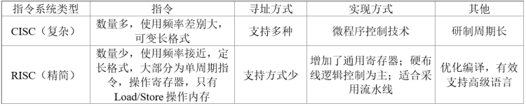
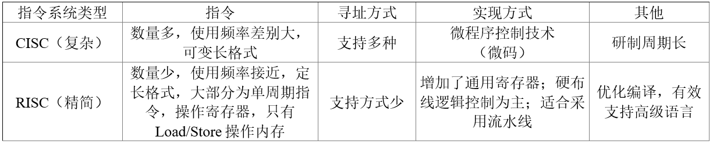

## 2011年下半年系统架构设计师考试上午真题（专业解析+参考答案）试题1
以下关于CISC（Complex Instruction Set Computer，复杂指令集计算机）和RISC（Reduced Instruction Set Computer，精简指令集计算机）的叙述中，错误的是（ ）。   A. 在CISC中，复杂指令都采用硬布线逻辑来执行 B. 一般而言，采用CISC技术的CPU，其芯片设计复杂度更高 C. 在RISC中，更适合采用硬布线逻辑执行指令 D. 采用RISC技术，指令系统中的指令种类和寻址方式更少  答案 A 试题分析

 
本题考查CISC与RISC的区别，这是一种常见的考题，二者的区别如表所示。

A选项完整的表述是：在CISC中，复杂指令一般采用微码来控制。 

## 1.1.2 2017年下半年系统架构设计师考试上午真题（专业解析+参考答案）试题2
RISC（精简指令系统计算机）的特点不包括（ ）。

A. 指令长度固定，指令种类尽量少

B. 寻址方式尽量丰富，指令功能尽可能强

C. 增加寄存器数目，以减少访存次数

D. 用硬布线电路实现指令解码，以尽快完成指令译码

答案 B

试题分析

**RISC** **与** **CISC** **的对比如表所示：**

寻址方式尽量丰富不是RISC的特点，而是CISC的特点。