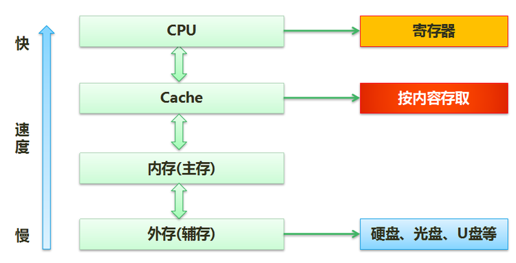

## 2014年下半年系统架构设计师考试上午真题（专业解析+参考答案）试题1
计算机采用分级存储体系的主要目的是为了（ ）。

A. 解决主存容量不足的问题

B. 提高存储器读写可靠性

C. 提高外设访问效率

D. 解决存储的容量、价格和速度之间的矛盾

答案 D

试题分析

分级存储体系中，速度快的存储器，单位价格高，而速度慢的存储器，单位价格低，所以利用分级方式，能得到很好的性价比。

## 2016年下半年系统架构设计师考试上午真题（专业解析+参考答案）试题2
在嵌入式系统的存储部件中，存取速度最快的是（ ）。  A. 内存 B. 寄存器组 C. Flash D. Cache  答案 B 试题分析

