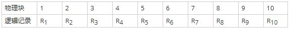

## 2016年下半年系统架构设计师考试上午真题（专业解析+参考答案）试题1

某计算机系统输入/输出采用双缓冲工作方式，其工作过程如下图所示，假设磁盘块与缓冲区大小相同，每个盘块读入缓冲区的时间T为10μs，由缓冲区送至用户区的时间M为6μs，系统对每个磁盘块数据的处理时间C为2μs。若用户需要将大小为10个磁盘块的Doc1文件逐块从磁盘读入缓冲区，并送至用户区进行处理，那么采用双缓冲需要花费的时间为（ ）μs，比使用单缓冲节约了（ ）μs时间。

A. 100

B. 108

C. 162

D. 180

A. 0

B. 8

C. 54

D. 62

答案 B,C

试题分析

第1题:
单缓冲区和双缓冲区都使用的是流水线技术，所以用流水线计算公式算就可以。计算流水线执行时间的理论公式是：第一条指令顺序执行时间+（指令条数-1）+周期，而周期是取各节点的最大处理时长。在本题中，单缓冲区的传送数据和输入数据是绑定在一起的，所以需要把它们结合起来视为流水线周期，构造成流水线后，整个过程划分为2个阶段，分别是16us，2us，根据流水线执行公式，流水线执行时间为：16us+2us+(10-1)*16us=162us。 而对于双缓冲区来说，它们有多余的缓冲区可以进行单独的传送和输入数据。读入缓冲区和由缓冲区送至用户区可以并行处理，对于这里构造成流水线后，整个过程划分为3个阶段，1、从磁盘读入到缓冲区（10us）；2、从缓冲区读入到（内存）用户区（6us）；3、处理（内存）用户区数据（2us）。根据流水线执行公式，流水线执行时间为：10us+6us+2us+（10-1)*10us=108us。
第2题:

## 2017年下半年系统架构设计师考试上午真题（专业解析+参考答案）试题2**

在磁盘上存储数据的排列方式会影响 I/O服务的总时间。假设每磁道划分成10个物理块，每块存放1个逻辑记录。逻辑记录R1，R2， …， R10存放在同一个磁道上， 记录的安排顺序如下表所示 ;

A. 189ms

B. 208ms

C. 289ms

D. 306ms

A. 60 ms

B. 90 ms

C. 109ms

D. 180ms

答案 D,B

试题分析

假定磁盘的旋转速度为30ms/周，磁头当前处在 R1的开始处。若系统顺序处理这些记录，使用单缓冲区，每个记录处理时间为6ms，则处理这10个记录的最长时间为 （ ）；若对信息存储进行优化分布后，处理10个记录的最少时间为（ ）。

第1题:本题是一个较为复杂的磁盘原理问题，我们可以通过模拟磁盘的运行来进行分析求解。运作过程为：
1、读取R1：耗时3ms。读取完，磁头位于R2的开始位置。
2、处理R1：耗时6ms。处理完，磁头位于R4的开始位置。
3、旋转定位到R2开始位置：耗时24ms。
4、读取R2：耗时3ms。读取完，磁头位于R3的开始位置。
5、处理R2：耗时6ms。处理完，磁头位于R5的开始位置。
6、旋转定位到R3开始位置：耗时24ms。
……
从以上分析可以得知，读取并处理R1一共需要9毫秒。而从R2开始，多了一个旋转定位时间，R2旋转定位到读取并处理一共需要33毫秒，后面的R3至R10与R2的情况一致。所以一共耗时：
9+33×9=306毫秒。
本题后面一问要求计算处理10个记录的最少时间。其实只要把记录间隔存放，就能达到这个目标。在物理块1中存放R1，在物理块4中存放R2，在物理块7中存放R3，依此类推，这样可以做到每条记录的读取与处理时间之和均为9ms，所以处理10条记录一共耗时90ms。
'''

## 2018年下半年系统架构设计师考试上午真题（专业解析+参考答案）试题3**

在磁盘调度管理中，应先进行移臂调度，再进行旋转调度。假设磁盘移动臂位于21号柱面上，进程的请求序列如下表所示。如果采用最短移臂调度算法，那么系统的响应序列应为（ ）。

A. ②⑧③④⑤①⑦⑥⑨

B. ②③⑧④⑥⑨①⑤⑦

C. ①②③④⑤⑥⑦⑧⑨

D. ②⑧③⑤⑦①④⑥⑨

答案 D

试题分析

最短移臂调度是指每次找距离当前磁头所在柱面最近的柱面。
1、初始位置是21柱面，所以请求序列中最近的柱面是23，对应请求号2、3、8；（排除选项C）
2、当前柱面是23，请求序列中最近的柱面是17，对应请求号是1、5、7；（排除选项A和选项B）
3、当前柱面号是17，请求序列中最近的柱面是32，对应请求号是4、6；（排除选项A、B、C）
4、当前柱面号是32，请求序列中最近的柱面是38，对应请求号是9； （排除选项B）
综上，只有选项D满足。

