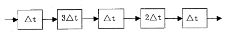
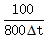
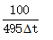
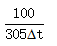
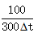
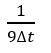
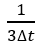
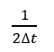
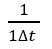

# 1.6 流水线

## **1.6.1 2016年下半年系统架构设计师考试上午真题（专业解析+参考答案）试题1**

某指令流水线由5段组成，各段所需要的时间如下图所示。
 
连续输入100条指令时的吞吐率为（ ）。

A. 

B. 

C. 

D. 

答案 C

试题分析

吞吐率＝需要处理的任务数/处理这些任务所需要的时间。

如港口的年货物吞吐率，就是讲1年时间内，处理了多少个集装箱。

计算流水线执行时间的理论公式是：第一条指令顺序执行时间+（指令条数-1）*周期，而周期 是取各节点的最大处理时长，在本题中，周期也就是3t，需要处理的任务数是：100条指令，所以这100条 指令使用流水线方式的执行时间是：（t+3t+t+2t+t）+（100-1）×3t=305t。

## **1.6.2 2017年下半年系统架构设计师考试上午真题（专业解析+参考答案）试题2**

某计算机系统采用5级流水线结构执行指令，设每条指令的执行由取指令（2Δt ）、分析指令（1Δt ）、取操作数（3Δt）、运算（1Δt）和写回结果（2Δt）组成， 并分别用5个子部件完成，该流水线的最大吞吐率为（ ） ；若连续向流水线输入10条指令，则该流水线的加速比为（ ）。

A. 

B. 

C. 

D. 

A. 1:10

B. 2:1

C. 5:2

D. 3:1

答案 B,C

试题分析
即：
n/（2Δt+1Δt+3Δt+1Δt+2Δt+（n-1）*3Δt）=n/（6Δt+3nΔt）
流水线的最大吞吐率就是上面的式子中，n趋向于无穷大的结果。当n趋向于无穷大时，上式的结果为：1/3Δt。所以应该选B。
流水线加速比=不用流水线的执行时间/使用流水线的执行时间
10条指令不用流水线的执行时间=（2Δt+1Δt+3Δt+1Δt+2Δt）×10=90Δt。
10条指令使用流水线的执行时间=（2Δt+1Δt+3Δt+1Δt+2Δt）+（10-1）×3Δt=36Δt。
所以加速比为：90Δt/36Δt=5∶2。
''

第1题:本题考查流水线计算。
流水线周期为：3Δt。

流水线的吞吐率为：指令条数/流水线执行时间。计算流水线执行时间的理论公式是：第一条 指令顺序执行时间+（指令条数-1）*周期，而周期是取各节点的最大处理时长。

