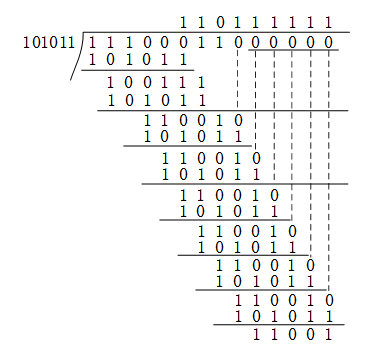

## 2018年下半年系统架构设计师考试上午真题（专业解析+参考答案）试题1**

若信息码字为111000110，生成多项式G(x)=x5+x3+x+1，则计算出的CRC校验码为（ ）。

A. 01101

B. 11001

C. 001101

D. 011001

答案 B

试题分析

循环冗余校验(Cyclic Redundancy Check，CRC)是一种根据网络数据包或电脑文件等数据产生简短固定位数校验码的一种散列函数，主要用来检测或校验数据传输或者保存后可能出现的错误。它是利用除法及余数的原理来作错误侦测的。
1、 将生成多项式的系数作为除数（101011）；
2、生成多项式的最高幂次数（5）作为检验码的位数。
3、将信息码左移生成多项式的最高幂次数（5）位，作为被除数。
4、执行模2除法，即异或操作。
5、等到（5位）余数即为校验码。

