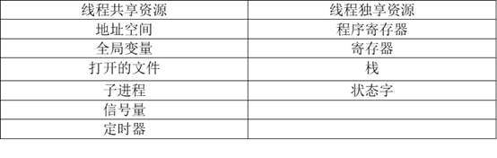

## 2011年下半年系统架构设计师考试上午真题（专业解析+参考答案）试题1

操作系统为用户提供了两类接口：操作一级和程序控制一级的接口，以下不属于操作一级的接口是（  ）。  

A. 操作控制命令  

B. 系统调用  

C. 菜单  

D. 窗口  

  

答案 B  

试题分析  

本题考查操作系统的基本概念。 操作系统是管理计算机硬件与软件资源的程序，同时也是硬件与用户之间的接口。操作系统既提供了与用户交互的接口，也提供了与应用程序交互的接口。用户可以通过菜单，命令，窗口与操作系统进行交互，而应用程序可以通过系统调用（如调用系统API）来与操作系统交互。

## 2020年下半年系统架构设计师考试上午真题（专业解析+参考答案）试题2

在支持多线程的操作系统中，假设进程P创建了线程T1、T2和T3，那么下列说法正确的是（）。  

  

A. 该进程中已打开的文件是不能被T1、T2 和T3共享的  

B. 该进程中T1的栈指针是不能被T2共享的，但可被T3共享  

C. 该进程中T1的栈指针是不能被T2和T3共享的  

D. 该进程中某线程的栈指针是可以被T1、T2和T3共享的  

  

答案 C  

试题分析  

本题是对线程相关概念的考查。

在同一进程中的各个线程都可以共享该进程所拥有的资源，如访问进程地址空间中的每一个虚地址；访问进程所拥有的已打开文件、定时器、信号量等，但是不能共享进程中某线程的栈指针。  

其中已打开的文件是可以被T1、T2 和T3共享的，A选项错误。线程的栈指针属于线程独享资源，不可被其他线程共享，D选项错误。  
T1的栈指针是T1线程独享的，不可以被T2和T3共享，所以B错误，C正确。  