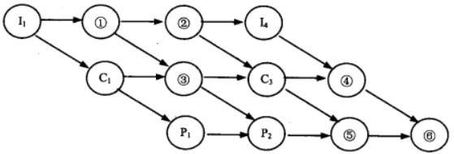
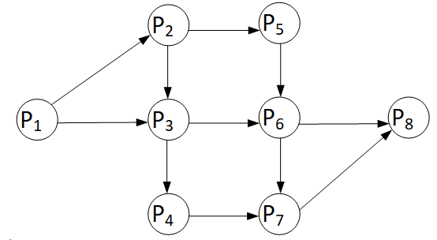
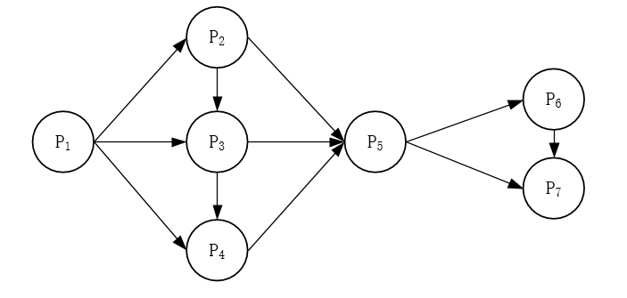

# 3.2 前趋图

## 2014年下半年系统架构设计师考试上午真题（专业解析+参考答案）试题1

某计算机系统中有一个CPU、一台输入设备和一台输出设备，假设系统中有四个作业T1、T2、T3和T4，系统采用优先级调度，且T1的优先级>T2的优先级>T3的优先级>T4的优先级。每个作业具有三个程序段：输入Ii、计算Ci和输出Pi(i=1,2,3,4)，其执行顺序为Ii→Ci→Pi。这四个作业各程序段并发执行的前趋图如下所示。图中①、②、③分别为（  ），④、⑤、⑥分别为（  ）。

  

A. I2、C2、C4  

B. I2、I3、C2  

C. C2、P3、C4  

D. C2、P3、P4  

  

A. C2、C4、P4  

B. I2、I3、C4  

C. I3、P3、P4  

D. C4、P3、P4  

  

答案 B,D  

试题分析  

第1题:在本题中，实际上是用了前趋图来表现流水线作业的情况。  
前趋图中表达了两种依赖关系。  
第一种是：一个作业中要完成的活动有先后顺序关系，前一个活动完成，后一个活动才能开始。这种关系从图上来看是：I1有箭头指向C1，C1有箭头指向P1，说明他们的执行顺序是：I1→C1→P1。  
第二种是：由于资源受限，只有一个CPU，那么第1个任务使用完CPU，第2个任务才能用，这是用横向的箭头来展示的。所以有I1指向I2，即①的位置应为：I2。依此类推。'

## 2017年下半年系统架构设计师考试上午真题（专业解析+参考答案）试题2

前趋图（Precedence Graph）是一个有向无环图，记为：→={(Pi，Pj )|Pimust complete before  Pj  may start}。假设系统中进程P={P1，P2，P3，P4，P5，P6，P7，P8}，且进程的前趋图如下：  

那么前趋图可记为：（  ）。  

A. →={（P2，P1），（P3，P1），（P4，P1），（P6，P4），（P7，P5），（P7，P6），（P8，P7）}  

B. →={（P1，P2），（P1，P3），（P1，P4），（P2，P5），（P5，P7），（P6，P7），（P7，P8）}  

C. →={（P1，P2），（P1，P3），（P1，P4），（P2，P5），（P3，P5），（P4，P6），（P5，P7），（P6，P7），（P7，P8）}  

D. →={（P2，P1），（P3，P1），（P4，P1），（P5，P2），（P5，P3），（P6，P4），（P7，P5），（P7，P6），（P8，P7）}  

  

答案 C  

试题分析  

本题考查前趋图，该图的标记方法是将图中各条边的起始记录好，以便描述这个图。以本题的图为例，由于P1有箭头指向P2，所以有(P1,P2)，又由于P1有指向P3的箭头，所以有(P1,P3)依次类推可得到完整的集合与C选项一致。

## 2019年下半年系统架构设计师考试上午真题（专业解析+参考答案）试题3

前趋图（Precedence Graph）是一个有向无环图，记为：→={ (Pi，Pj) |Pi must complete before Pj may start}。假设系统中进程 P={P1，P2，P3，P4 ，P5 ，P6，P7，P8} ，且进程的前趋图如下：  

那么，该前趋图可记为（ ）。  

A. →={（P1，P2），（P1，P3），（P1，P4），（P2，P5），（P3，P5），（P4，P7），（P5，P6），（P6，P7），（P6，P8），（P7，P8）}  

B. →={（P1，P2），（P3，P1），（P4，P1），（P5，P2），（P5，P3），（P6，P4），（P7，P5），（P7，P6），（P6，P8），（P8，P7）}  

C. →={（P1，P2），（P1，P3），（P1，P4），（P2，P5），（P3，P6），（P4，P7），（P5，P6），（P6，P7），（P6，P8），（P7，P8）}  

D. →={（P1，P2），（P1，P3），（P2，P3），（P2，P5），（P3，P6），（P3，P4），（P4，P7），（P5，P6），（P6，P7），（P6，P8），（P7，P8）}  

  

答案 D  

试题分析  

本题考查前趋图，该图的标记方法是将图中各条边的起始记录好，以便描述这个图。以本题的图为例，由于P1有箭头指向P2，所以有（P1，P2），又由于P1有指向P3的箭头，所以有（P1，P3）。依次类推可得到完整的集合与D选项一致。

## 2020年下半年系统架构设计师考试上午真题（专业解析+参考答案）试题4

前趋图（Precedence Graph）是一个有向无环图，记为：→={（Pi，Pj）|Pi must complete before Pj may start}。假设系统中进程P={P1，P2，P3，P4，P5，P6，P7}，且进程的前趋图如下：

那么，该前趋图可记为（ ）。

  

A. →={（P1，P2），（P3，P1），（P4，P1），（P5，P2），（P5，P3），（P6，P4），（P7，P5），（P7，P6），（P5，P6），（P4，P5），（P6，P7）}  

B. →={（P1，P2），（P1，P3），（P1，P4），（P2，P5），（P2，P3），（P3，P4），（P3，P5），（P4，P5），（P5，P6），（P5，P7），（P6，P7）}  

C. →={（P1，P2），（P1，P3），（P1，P4），（P2，P5），（P2，P3），（P3，P4），（P5，P3），（P4，P5），（P5，P6），（P7，P5），（P6，P7）}  

D. →={（P1，P2），（P1，P3），（P2，P3），（P2，P5），（P3，P6），（P3，P4），（P4，P7），（P5，P6），（P6，P7），（P6，P5），（P7，P5）}  

  

答案 B  

试题分析  

本题是典型的前趋图考查题型。  
前趋图中，箭线代表前趋关系，结点代表进程，本图中P1是起点，P7是终点，一共有11个前趋关系。每个前趋关系可用（结点1，结点2）的形式表示，如：P1到P2之间的前趋关系可用：（P1，P2）表示。  
这里可以用排除法得到结果，选项中存在错误的前趋关系就可以直接排除。A选项（P3，P1）错误，不存在P3->P1的前趋关系。C选项（P5，P3）错误，不存在P5->P3的前趋关系。D选项（P3，P6）错误，不存在P3->P6的前趋关系。B选项正确。 

