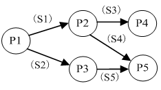
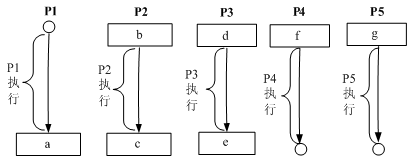
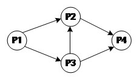
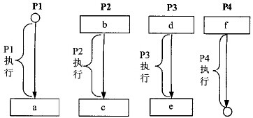
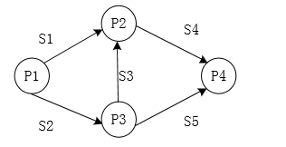
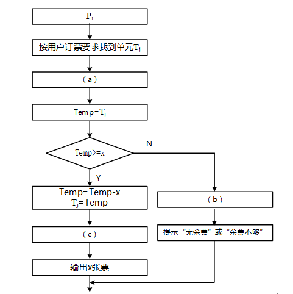

## 2011年下半年系统架构设计师考试上午真题（专业解析+参考答案）试题1

进程P1、P2、P3、P4和P5的前趋图如下：  

若用PV操作控制进程P1～P5并发执行的过程，则需要设置5个信号量S1、S2、S3、S4和S5，进程间同步所使用的信号量标注在上图中的边上，且信号量S1～S5的初值都等于零，初始状态下进程P1开始执行。下图中a、b和c处应分别填写（  ）；d和e处应分别填写（  ），f和g处应分别填写（  ）。  

  

A. V(S1) V(S2)、P(S1)和V(S3) V(S4)  

B. P(S1) V(S2)、P(S1)和P(S2) V(S1)  

C. V(S1) V(S2)、P(S1)和P(S3) P(S4)  

D. P(S1) P(S2)、V(S1)和P(S3) V(S2)  

  

A. P(S1) 和V(S5)  

B. V(S1) 和P(S5)  

C. P(S2) 和V(S5)  

D. V(S2) 和P(S5)  

  

A. P(S3)和V(S4) V(S5)  

B. P(S3)和P(S4) P(S5)  

C. V(S3)和V(S4) V(S5)  

D. V(S3)和P(S4) P(S5)  

  

答案 A,C,B  

试题分析  

本题考查操作系统中的前趋图和PV操作。 从题目的前趋图，可以得知以下约束关系： （1）P1执行完毕，P2与P3才能开始； （2）P2执行完毕，P4才能开始； （3）P2与P3都执行完，P5才能开始。 分析清楚这种制约关系，解题也就容易了。 

（1）从“P1执行完毕，P2与P3才能开始”可以得知：P2与P3中的b与d位置，分别应填P（S1）和P（S2），以确保在P1执行完毕以前，P2与P3不能执行。当然当P1执行完毕时，应该要对此解锁，所以P1中的a位置应填V（S1）与V（S2）。 （2）从“P2执行完毕，P4才能开始”可以得知：P4的f位置，应填P（S3），而P2的结束位置c应有V（S3）。 （3）从“P2与P3都执行完，P5才能开始”可以得知：P5的g位置，应填P（S4）与P（S5），而对应的P2的结束位置c应有V（S4），结合前面的结论可知，c应填V（S3）与V（S4）。而e应填V（S5）。

## 2012年下半年系统架构设计师考试上午真题（专业解析+参考答案）试题2

假设系统中有n个进程共享3台打印机，任一进程在任一时刻最多只能使用1台打印机。若用PV 操作控制n个进程使用打印机，则相应信号量S的取值范围为（  ）；若信号量S的值为-3，则系统中有（  ）个进程等待使用打印机。  

A. 0，-1，…，- (n-1)  

B. 3，2，1，0，-1，…，- (n-3)  

C. 1，0，-1，…，- (n-1)  

D. 2，1，0，-1，…，- (n-2)  

  

A. 0  

B. 1  

C. 2  

D. 3  

  

答案 B,D  

试题分析  

本题考查操作系统进程管理方面的基础知识。  
第1空的正确答案为选项B。根据题意，假设系统中有n个进程共享3台打印机，意味着每次只允许3个进程进入互斥段，那么信号量的初值应为3。可见，根据排除法只有选项B中含有3。  
第2空的正确答案为选项D。信号量S的物理意义为：当S≥0时，表示资源的可用数；当S<0时，其绝对值表示等待资源的进程数。

## 2013年下半年系统架构设计师考试上午真题（专业解析+参考答案）试题3

进程P1、P2、P3和P4的前趋图如下所示：

若用PV操作控制进程P1~P4并发执行的过程，则需要设置5个信号量S1、S2、S3、S4和S5，且信号量S1-S5的初值都等于0。下图中a、b和c处应分别填写（  ）；d、e和f处应分别填写（  ）。

  

A. V(S1)V(S2)、P(S1)V(S3)和V(S4)  

B. P(S1)V(S2)、P(S1)P(S2)和V(S1)  

C. V(S1)V(S2)、P(S1)P(S3)和V(S4)  

D. P(S1)P(S2)、V(S1)P(S3)和V(S2)  

  

A. P(S2)、V(S3)V(S5)和P(S4)P(S5)  

B. V(S2)、P(S3)V(S5)和V(S4)P(S5)  

C. P(S2)、V(S3)P(S5)和P(S4)V(S5)  

D. V(S2)、V(S3)P(S5)和P(S4)V(S5)  

  

答案 C,A  

试题分析  

本题只要将信号量在前趋图中标识出来，题目就非常容易解了。在前趋图中，每个箭头对应一个信号量，编号从左至右，从上至下，由小到大，如图所示。  

标出信号量之后，从某进程引出的信号量，在该进程末尾需要对信号量执行V操作，而信号量箭头指向的进程开始处应有信号量的P操作。  
以P1为例，S1与S2从P1发出，所以在P1末尾处要执行V（S1）V（S2），而在P2开始处应执行P（S1）P（S3）。

## 2013年下半年系统架构设计师考试上午真题（专业解析+参考答案）试题4

在实时操作系统中，两个任务并发执行，一个任务要等待另一个任务发来消息，或建立某个条件后再向前执行，这种制约性合作关系被称为任务的（  ）。  

A. 同步  

B. 互斥  

C. 调度  

D. 执行  

  

答案 A  

试题分析  

同步（英语：Synchronization），指在一个系统中所发生的事件（event），之间进行协调，在时间上出现一致性与统一化的现象。  
在本题中，一个任务要等待另一个任务发来消息，这就是一种同步协调机制。

## 2015年下半年系统架构设计师考试上午真题（专业解析+参考答案）试题5

某航空公司机票销售系统有n个售票点，该系统为每个售票点创建一个进程Pi（i=1，2，…，n）管理机票销售。假设Tj（j=1，2，…，m）单元存放某日某航班的机票剩余票数，Temp为Pi进程的临时工作单元，x为某用户的订票张数。初始化时系统应将信号量S赋值为（ ）。Pi进程的工作流程如下图所示，若用P操作和V操作实现进程间的同步与互斥，则图中空（a），空（b）和空（c）处应分别填入（ ）。

  

A. 0  

B. 1  

C. 2  

D. 3  

  

A. P（S），V（S）和V（S）  

B. P（S），P（S）和V（S）  

C. V（S），P（S）和P（S）  

D. V（S），V（S）和P（S）  

  

答案 B,A  

试题分析  

在此题中，信号量S是一个互斥信号量，作用是避免多个进程同时对余票数量进行处理导致问题，所以初值应置为1。  
程序中（a）应使用P（S）操作，代表占用资源，（c）是成功完成订票时释放资源进行的操作，应该进行V（S）操作，（b）是指当前没有足够的余票，未完成出票，此时，也要释放资源，所以也应该进行V（S）操作。  

