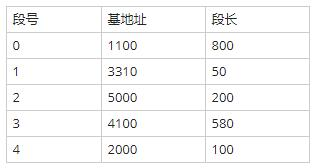

## 2011年下半年系统架构设计师考试上午真题（专业解析+参考答案）试题1

虚拟存储器发生页面失效时，需要进行外部地址变换，即实现（  ）的变换。

  

A. 虚地址到主存地址  

B. 主存地址到Cache地址  

C. 主存地址到辅存物理地址  

D. 虚地址到辅存物理地址  

  

答案 D  

试题分析  

虚拟存储器（Virtual Memory）：在具有层次结构存储器的计算机系统中，自动实现部分装入和部分替换功能，能从逻辑上为用户提供一个比物理贮存容量大得多，可寻址的“主存储器”。虚拟存储区的容量与物理主存大小无关，而受限于计算机的地址结构和可用磁盘容量。其页面的置换依据相应的页面置换算法进行，当页面失效时，需要进行数据交换，此时涉及到逻辑地址（虚地址）到辅存物理地址的变换，所以本题应选D。

## 2013年下半年系统架构设计师考试上午真题（专业解析+参考答案）试题2

某操作系统采用分页存储管理方式，下图给出了进程A和进程B的页表结构。如果物理页的大小为512字节，那么进程A逻辑地址为1111（十进制）的变量存放在（  ）号物理内存页中。假设进程A的逻辑页4与进程B的逻辑页5要共享物理页8，那么应该在进程A页表的逻辑页4和进程B页表的逻辑页5对应的物理页处分别填（  ）。  

A. 9  

B. 2  

C. 4  

D. 6  

  

A. 4、5  

B. 5、4  

C. 5、8  

D. 8、8  

  

答案 C,D  

试题分析  

十进制数1111转化为二进制数为：10001010111。

物理页的大小为512字节，这说明页内地址为9个二进制位，进程A的逻辑地址中，右边的9位是页内地址，左边的2位是页号，即：10 001010111。页号为二进制的10，即十进制的2，对应的物理页号为4。 

若进程A页表的逻辑页4和进程B页表的逻辑页5要共享物理页8，则说明他们都对应物理页8，所以均填8。

## 2015年下半年系统架构设计师考试上午真题（专业解析+参考答案）试题3

假设系统采用段式存储管理方法，进程P的段表如下所示。逻辑地址（  ）不能转换为对应的物理地址；不能转换为对应的物理地址的原因是进行（  ）。

A. (0，790)和(2，88)  

B. (1，30)和(3，290)  

C. (2，88)和(4，98)  

D. (0，810)和(4，120)  

  

A. 除法运算时除数为零  

B. 算术运算时有溢出  

C. 逻辑地址到物理地址转换时地址越界  

D. 物理地址到逻辑地址转换时地址越界  

  

答案 D,C  

试题分析  

逻辑地址（0，810）不能转换成对应的物理地址，原因是：0号段的段长为800，而此逻辑地址偏移量为810，已超出段长，所以越界。逻辑地址（4，120）存在同样的问题。

## 2020年下半年系统架构设计师考试上午真题（专业解析+参考答案）试题4

分页内存管理的核心是将虚拟内存空间和物理内存空间皆划分为大小相同的页面，并以页面作为内存空间的最小分配单位。下图给出了内存管理单元的虚拟地址到物理地址的翻译过程，假设页面大小为4KB，那么CPU发出虚拟地址0010000000000100后，其访问的物理地址是（ ）。  

A. 0110000000000100  

B. 0100000000000100  

C. 1100000000000000  

D. 1100000000000010  

  

答案 A  

试题分析  

本题考查的是页式存储地址转换相关计算。

逻辑地址=逻辑页号+页内地址，物理地址=物理块号+页内地址。他们的页内地址是相同的，变化的时候只需要将逻辑页号变换为物理块号就可以了。已知页面大小为4K，也就是212，所以页内地址有12位。已知逻辑地址为：0010 0000 0000 0100 所以高4位为页号，低12位为页内偏移量，所以逻辑地址对应的逻辑页号为2（10），由图可知对应的物理块号为110。最后把物理块号和页内偏移地址拼合得：0110 0000 0000 0100，答案选A。

## 2020年下半年系统架构设计师考试上午真题（专业解析+参考答案）试题5

以下关于计算机内存管理的描述中，（）属于段页式内存管理的描述。  

  

A. 一个程序就是一段，使用基址极限对来进行管理  

B. 一个程序分为许多固定大小的页面，使用页表进行管理  

C. 程序按逻辑分为多段，每一段内又进行分页，使用段页表来进行管理  

D. 程序按逻辑分成多段，用一组基址极限对来进行管理。 基址极限对存放在段表里  

  

答案 C  

试题分析  

本题考查的是段页式存储的基本概念。

段页式存储管理方式即先将用户程序分成若干个段，再把每个段分成若干个页，并为每一个段赋予一个段名，使用段页表来进行管理。所以正确答案为C选项。选项A的管理方法属于分区式管理；选项B的管理方法属于页式管理；选项D的管理方法属于**段式管理**。