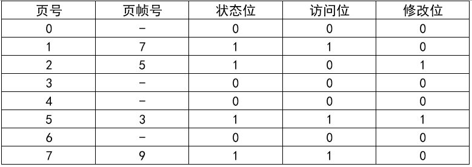

## 2019年下半年系统架构设计师考试上午真题（专业解析+参考答案）试题1

进程P有8个页面，页号分别为0~7，页面大小为4K ，假设系统给进程P分配了4个存储块，进程P的页面变换表如下所示。表中状态位等于1和0分别表示页面在内存和不在内存。若进程P要访问的逻辑地址为十六进制 5148H，则该地址经过变换后， 其物理地址应为十六进制（  ）；如果进程P要访问的页面6不在内存，那么应该淘汰页号为（  ）的页面。  

A. 3148H  

B. 5148H  

C. 7148H  

D. 9148H  

  

A. 1  

B. 2  

C. 5  

D. 9  

  

答案 A,B  

试题分析   

本题考查操作系统存储管理方面的基础知识。 

试题第一空的正确选项为A。

根据题意，页面大小为4K，逻辑地址为十六进制5148H其页号为5，页内地址为148H，查页表后可知页帧号（物理块号）为3，该地址经过变换后，其物理地址应为页帧号3拼上页内地址148H，即十六进制3148H。 

试题第二空的正确选项为B。

根据题意，首先，查看表格，没有页号为9的页面，排除D选项，然后，因为页面变换表中状态位等于1和0分别表示页面在内存或不在内存，所以1、2、5和7号页面在内存。当访问的页面6不在内存时，系统应该首先淘汰未被访问的页面，因为根据程序的局部性原理，最近未被访问的页面下次被访问的概率更小；如果页面最近都被访问过，应该先淘汰未修改过的页面，因为未修改过的页面内存与辅存一致，故淘汰时无须写回辅存，使系统页面置换代价更小。经上述分析，1、5和7号页面都是最近被访问过的，但2号页面最近未被访问过，故应该淘汰2号页面。  