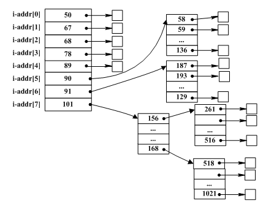

## 2012年下半年系统架构设计师考试上午真题（专业解析+参考答案）试题1

假设文件系统采用索引节点管理，且索引节点有8个地址项iaddr\[0\]～iaddr\[7\]，每个地址项大小为4B，iaddr\[0\]～iaddr\[4\]采用直接地址索引，iaddr\[5\]和iaddr\[6\]采用一级间接地址索引，iaddr\[7\]采用二级间接地址索引。假设磁盘索引块和磁盘数据块大小均为1KB字节，文件File1的索引节点如下图所示。若用户访问文件File1中逻辑块号为5和261的信息，则对应的物理块号分别为（  ）；101号物理块存放的是（  ）。  

  

A. 89和90  

B. 89和136  

C. 58和187  

D. 90和136  

  

A. File1的信息  

B. 直接地址索引表  

C. 一级地址索引表  

D. 二级地址索引表  

  

答案 C,D  

试题分析   

本题考查操作系统文件管理方面的基础知识。  
根据题意，磁盘索引块为1KB，每个地址项大小为4B，故每个磁盘索引块可存1024/4=256个物理块地址。

又因为文件索引节点中有8个地址项，其中5个地址项为直接地址索引，这意味着逻辑块号为0～4的为直接地址索引；2个地址项是一级间接地址索引，其中第一个地址项指出的物理块中是一张一级间接地址索引表，存放逻辑块号为5～260对应的物理块号，第二个地址项指出的物理块中是另一张一级间接地址索引表，存放逻辑块号为261～516对应的物理块号。

经上分析，从图中不难看出，逻辑块号为5的信息应该存放在58号物理块中，逻辑块号为261的信息应该存放在187号物理块中。  
由题中可知，iaddr[7]采用二级间接地址索引，且iaddr[7]中存放的物理块号为101。1个地址项是二级间接地址索引，这意味着该地址项指出的物理块中存放的是256个一级间接地址索引表，故101号物理块存放的是二级间接地址索引表。  

## 2014年下半年系统架构设计师考试上午真题（专业解析+参考答案）试题2

某文件系统文件存储采用文件索引节点法。假设磁盘索引块和磁盘数据块大小均为1KB，每个文件的索引节点中有8个地址项iaddr\[0\]～iaddr\[7\]，每个地址项大小为4字节，其中iaddr\[0\]～iaddr\[5\]为直接地址索引，iaddr\[6\]是一级间接地址索引，iaddr\[7\]是二级间接地址索引。如果要访问icwutil.dll文件的逻辑块号分别为0、260和518，则系统应分别采用（  ）。该文件系统可表示的单个文件最大长度是（  ）KB。   

  

  

A. 直接地址索引、一级间接地址索引和二级间接地址索引  

B. 直接地址索引、二级间接地址索引和二级间接地址索引  

C. 一级间接地址索引、一级间接地址索引和二级间接地址索引  

D. 一级间接地址索引、二级间接地址索引和二级间接地址索引  

  

A. 518  

B. 1030  

C. 16514  

D. 65798  

  

答案 A,D  

试题分析  

第1题:

直接索引范围：0-5，即对应0-5号盘块，共6**1KB=6KB。  
一级间接索引范围：对应一个大小为1KB的索引盘块，共256（1KB/4B）个地址项，对应6-261号盘块，共256*1KB=256KB。  
二级间接索引范围：对应一个大小为1KB的一级索引盘块和256个大小为1KB的二级索引盘块，每个二级索引盘块有256个地址项对应256个盘块，所以整个二级间接索引对应65536个盘块，对应盘块为262-65797，共65536*1KB=65536KB。  
所以该系统可表示的单个文件最大长度是：6+256+65536=65798KB

## 2016年下半年系统架构设计师考试上午真题（专业解析+参考答案）试题3

某文件系统文件存储采用文件索引节点法。假设文件索引节点中有8个地址项iaddr\[0\]～iaddr\[7\]，每个地址项大小为4字节，其中地址项iaddr\[0\]～iaddr\[5\]为直接地址索引，iaddr\[6\]是一级间接地址索引，iaddr\[7\]是二级间接地址索引，磁盘索引块和磁盘数据块大小均为4KB。该文件系统可表示的单个文件最大长度是（  ）KB。若要访问iclsClient.dll文件的逻辑块号分别为6、520和1030，则系统应分别采用（  ）。  

A. 1030  

B. 65796  

C. 1049606  

D. 4198424  

  

A. 直接地址索引、一级间接地址索引和二级间接地址索引  

B. 直接地址索引、二级间接地址索引和二级间接地址索引  

C. 一级间接地址索引、一级间接地址索引和二级间接地址索引  

D. 一级间接地址索引、二级间接地址索引和二级间接地址索引  

  

答案 D,C  

试题分析  

直接索引范围：6×4KB=24KB ，对应逻辑块号：0-5； 
一级间接索引范围：(4KB/4B)×4KB=4096KB ，对应逻辑块号：6-1029； 
二级间接索引范围：(4KB/4B)× (4KB/4B)×4KB=4194304KB ，对应逻辑块号：1030以及上。 
24KB + 4096KB + 4194304KB = 4198424KB  

## 2018年下半年系统架构设计师考试上午真题（专业解析+参考答案）试题4

某文件系统采用多级索引结构， 若磁盘块的大小为4KB，每个块号需占4B，那么采用二级索引结构时的文件最大长度可占用（  ）个物理块。

  

A. 1024  

B. 1024×1024  

C. 2048×2048  

D. 4096×4096  

  

答案 B  

试题分析  

本题考查索引文件结构。在索引文件结构中，二级间接索引是指：索引结点对应的盘块存索引表，在索引表指向的盘块中依然存索引表，由于每个索引表可以存4K/4=1024个块号，所以二级索引可对应1024*1024个物理块。  