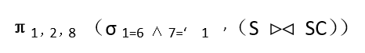
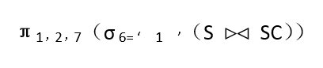
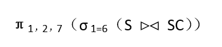
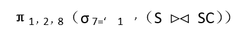
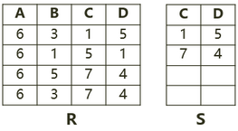
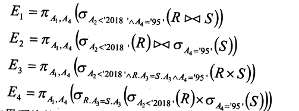

## 2011年下半年系统架构设计师考试上午真题（专业解析+参考答案）试题1

给定学生S（学号，姓名，年龄，入学时间，联系方式）和选课SC（学号，课程号，成绩）关系，若要查询选修了1号课程的学生学号、姓名和成绩，则该查询与关系代数表达式（  ）等价。

  

  

A. 


B. 


C. 


D. 

  


答案 B  

试题分析  

本题考查数据库中的关系代数。  
解答本题需要对关系代数中的自然连接有一定了解。自然连接操作会自动以两个关系模式中共有属性值相等作为连接条件，对于连接结果，将自动去除重复的属性。

所以在本题中，连接条件为两个表的学号相等，当连接操作完成以后，形成的结果表，有属性“学号，姓名，年龄，入学时间，联系方式，课程号，成绩”，此时要选择1号课程的学生记录，应使用条件6= “1”，其含义是表中的第6个属性值为“1”。所以本题应选B


## 2013年下半年系统架构设计师考试上午真题（专业解析+参考答案）试题2

给定员工关系EMP（EmpID，Ename，sex，age，tel，DepID），其属性含义分别为：员工号、姓名、性别、年龄、电话、部门号；部门关系DEP(DepID，Dname，Dtel，DEmpID)，其属性含义分别为：部门号、部门名、电话，负责人号。若要求DepID参照部门关系DEP的主码DepID，则可以在定义EMP时用（  ）进行约束。若要查询开发部的负责人姓名、年龄，则正确的关系代数表达式为（  ）。

  

  

A. Primary Key (DepID) On DEP (DepID)  

B. Primary Key (DepID) On EMP (DepID)  

C. Foreign Key (DepID) References DEP (DepID)  

D. Foreign Key (DepID) References EMP (DepID)  

  

A. π2,4(σ8=’开发部’(EMP×DEP))  

B. π2,4(σ1=9(EMP
σ2=’开发部’(DEP)))  

C. π2,3(EMP×σ2=’开发部’(DEP))  

D. π2,3(π1,2,4,6(EMP)
σ2=’开发部’(DEP))  

  

答案 C,B  

试题分析  

第1题:本题中要求“DepID参照部门关系DEP的主码DepID”，实际上就是在创建EMP时，将DelID定义为外键。其具体定义语法为：Foreign Key(DepID) References DEP(DepID)。  

'

第2题:

第二问要求“查询开发部的负责人姓名、年龄”的关系代数表达式，选项B是先进行σ（2=‘开发部’（DEP））运算，即在DEP关系中选择部门名Dname-‘开发部’的元组；然后将EMP关系与其进行 EMP.DepID=DEP.DepID的自然连接，并去掉右边的重复属性“DEP.DepID”，自然连接后的属性列为 （EmpID，Ename，sex，age，tel，DepID，Dname，Dtel，DEmpID)；再此基础上进行σ(1=9)运算，即进行员工号EmpID等于部门负责人号DEmpID的选取运算；最后进行属性列2(Ename)和属性列4(age)的投影运算。


## 2014年下半年系统架构设计师考试上午真题（专业解析+参考答案）试题3

若关系模式R和S分别为：R（A，B，C，D），S（B，C，E，F），则关系R与S自然联结运算后的属性列有（  ）个，与表达方式π1,3,5,6(σ3<6(R⋈S))等价的SQL语句为：  

```sql
SELECT ______ FROM R,S WHERE _______;
```

  

A. 4  

B. 6  

C. 7  

D. 8  

  

A. A,R.C,E,F  

B. A,C,S.B,S.E  

C. A,C,S.B,S.C  

D. R.A,R.C,S.B,S.C  

  

A. R.B=S.B AND R.C=S.C AND R.C<S.B  

B. R.B=S.B AND R.C=S.C AND R.C<S.F  

C. R.B=S.B OR R.C=S.C OR R.C<S.B  

D. R.B=S.B OR R.C=S.C OR R.C<S.F  

  

答案 B,A,B  

试题分析  

本题考查关系代数运算与SQL查询方面的基础知识。  
第一空的正确答案为选项B。

自然连接R⋈S是指R与S关系中相同属性列名的等值连接运算后，再去掉右边重复的属性列名S.B、S.C，所以经R⋈S运算后的属性列名为：R.A、R.B、R.C、R.D、S.E和S.F，共有6个属性列。  
第二空的正确答案为选项A。

π1,3,5,6（σ3<6（R⋈S））的含义是从R⋈S结果集中选取R.C<S.F的元组，再进行R.A、R.C、S.E和S.F投影，故选项A是正确的。  
第三空的正确答案为选项B。由于自然连接R⋈S是指R与S关系中相同属性列名的等值连接，故需要用条件“WHERE R.B=S.B AND R.C=S.C”来限定；又由于经自然连接R⋈S运算后，去掉了右边重复的属性列名S.B、S.C，使得第三列属性列名和第六列属性列名分别为R.C、S.F，所以选取运算σ3<6需要用条件“WHERE R.C<S.F”来限定。''


## 2015年下半年系统架构设计师考试上午真题（专业解析+参考答案）试题4

若关系R、S如下图所示，则关系R与S进行自然连接运算后的元组个数和属性列数分别为（  ）；关系代数表达式π1,4(σ3=6(R×S))与关系代数表达式（  ）等价。  


  

A. 6和6  

B. 4和6  

C. 3和6  

D. 3和4  

  

A. πA,D(σC=D(R×S))  

B. πA,R.D(σS.C=R.D(R×S))  

C. πA,R.D(σR.C=S.D(R×S))  

D. πR.A,R.D(σS.C=S.D(R×S))  

  

答案 D,C  

试题分析  

第1题:元组是行，代表记录数。  

属性是列，对应数据表的列数。  
题目所讲的是自然连接，自然连接规则是：  
（1）把参与运算的两个关系模式R与S的相同名称列找来。即：C与D。  
（2）针对R与S做C与D属性的等值连接。同时两个关系的相同属性只保留1个，即两个C只保留1个，两个D也只保留1个。  
这样产生的结果记录为：  
6 3 1 5  
6 5 7 4  
6 3 7 4


## 2016年下半年系统架构设计师考试上午真题（专业解析+参考答案）试题5

给定关系模式R（A，B，C，D，E）、S（D，E，F，G）和π1,2,4,6（R⋈S），经过自然连接和投影运算后的属性列数分别为（  ）。

  

A. 9和4  

B. 7和4  

C. 9和7  

D. 7和7  

  

答案 B  

试题分析  

R与S进行自然连接后，结果属性集为：A，B，C，D，E，F，G。  
投影操作后，结果为：A，B，D，F。  


## 2018年下半年系统架构设计师考试上午真题（专业解析+参考答案）试题6

给定关系R（A，B，C，D，E）与S（A，B，C，F，G），那么与表达式π1，2，4，6，7（σ1<6（R⋈S））等价的SQL语句如下：  

```sql
SELECT ______ FROM R,S WHERE _______;
```

  


A. R.A，R.B，R.E，S.C，G  

B. R.A，R.B，D，F，G  

C. R.A，R.B，R.D，S.C，F  

D. R.A，R.B，R.D，S.C，G  

  

A. R.A=S.A OR R.B=S.B OR R.C=S.C OR R.A<S.F  

B. R.A=S.A OR R.B=S.B OR R.C=S.C OR R.A<S.B  

C. R.A=S.A AND R.B=S.B AND R.C=S.C AND R.A<S.F  

D. R.A=S.A AND R.B=S.B AND R.C=S.C AND R.A<S.B  

  

答案 B,C  

试题分析  

第1题:

本题考查关系代数运算与SQL语言的对应关系。注意本题中R与S是做自然连接操作，操作时会将R与S中相同字段名做等值连接，并将结果集去重复。所以R与S自然连接后的结果包括以下属性：  
R.A，R.B，R.C，D，E，F，G。  
关系代数选择条件为“1<6”，即R.A<F。  
关系代数投影操作条件为“1，2，4，6，7”，对应的属性为：R.A，R.B，D，F，G。  


## 2018年下半年系统架构设计师考试上午真题（专业解析+参考答案）试题7

在关系R（A1，A2，A3）和S（A2，A3，A4）上进行关系运算的4个等价的表达式E1、E2、E3和E4如下所示：



如果严格按照表达式运算顺序执行，则查询效率最高的是表达式（  ）。

  

A. E1  

B. E2  

C. E3  

D. E4  

  

答案 D  

试题分析  

本题考查关系代数运行效率问题。解决这类问题，有一个通用原则，即，存在联接操作与选择操作的，尽可能早的完成选择操作，这样能降低参与联接操作的数据量，极大提升运算效率。  

本题题目有瑕疵，E2和E4是不等价的，虽然自然连接比笛卡尔积效率高，但E4由于本身与E2不等价，缺少了一次等值比较（R.A2=S.A2），所以效率更高。     