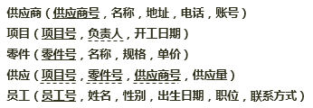
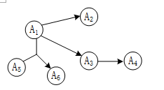
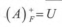
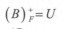
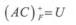
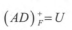
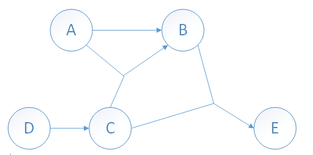

## 2011年下半年系统架构设计师考试上午真题（专业解析+参考答案）试题1

某企业工程项目管理数据库的部分关系模式如下所示，其中带实下划线的表示主键，虚下划线的表示外键。  

其中供应关系是（  ）的联系。若一个工程项目可以有多个员工参加，每个员工可以参加多个项目，则项目和员工之间是（）联系。对项目和员工关系进行设计时，（  ）设计成一个独立的关系模式。  

A. 2个实体之间的1∶n  

B. 2个实体之间的n∶m  

C. 3个实体之间的1∶n∶m  

D. 3个实体之间的k∶n∶m  

  

A. 1∶1  

B. 1∶n  

C. n∶m  

D. n∶1  

  

A. 多对多的联系在向关系模型转换时必须  

B. 多对多的联系在向关系模型转换时无须  

C. 只需要将一端的码并入多端，所以无须  

D. 不仅需要将一端的码并入多端，而且必须  

  

答案 D,C,A  

试题分析  

第1题:

本题考查数据库逻辑设计相关内容。  
题目虽然有多个问题，但实际上只考查了一个知识点——实体之间的联系。

供应关系中，有属性：项目号，零件号，供应商号。

这些属性分别来自供应商、项目、零件这三个关系，并且，一个供应商可以向多个项目供应零件，一个供应商可以供应多种零件，一个项目可以由多个供应商供应零件，一个项目可以使用多种零件，而一种零件可以由多个不同供应商来提供，一种零件可用于不同项目。

这说明供应关系涉及3个实体，这3个实体之间的关系是k∶n∶m。  
从题目的描述“若一个工程项目可以有多个员工参加，每个员工可以参加多个项目”可以得知，项目和员工的关系是n∶m。

在实体转关系模式过程中，存在3种类型的联系，他们的处理方式如下：  
1∶1联系：在两个关系模式中的任意一个模式中，加入另一个模式的键和联系类型的属性；  
1∶n联系：在n端实体类型对应的关系模式中加入1端实体类型的键和联系类型的属性；  
m∶n联系：将联系类型也转换成关系模式，属性为两端实体类型的键加上联系类型的属性。  
试题中是m：n联系，所以需要把联系单独转成一个关系模式。  

## 2012年下半年系统架构设计师考试上午真题（专业解析+参考答案）试题2

某商场商品数据库的商品关系模式P（商品代码，商品名称，供应商，联系方式，库存量），函数依赖集F={商品代码→商品名称，（商品代码，供应商）→库存量，供应商→联系方式}。商品关系模式P达到（  ）；该关系模式分解成（  ）后，具有无损连接的特性，并能够保持函数依赖。  

A. 1NF  

B. 2NF  

C. 3NF  

D. BCNF  

  

A. P1（商品代码，联系方式），P2（商品名称，供应商，库存量）  

B. P1（商品名称，联系方式），P2（商品代码，供应商，库存量）  

C. P1（商品代码，商品名称，联系方式），P2（供应商，库存量）  

D. P1（商品代码，商品名称），P2（商品代码，供应商，库存量），P3（供应商，联系方式）  

  

答案 A,D  

试题分析  

本题考查的是应试者关系数据库方面的基础知识。  
根据题意，零件P关系中的（商品代码，供应商）可决定的零件P关系的所有属性，所以零件P关系的主键为（商品代码，供应商）；又因为，根据题意（商品代码，供应商）→商品名称，而商品代码→商品名称，供应商→联系方式，可以得出商品名称和联系方式都部分依赖于码，所以，该关系模式属于1NF。  
关系模式P属于1NF，1NF存在冗余度大、修改操作的不一致性、插入异常和删除异常四个问题。所以需要对模式分解，其中选项A、选项B和选项C的分解是有损且不保持函数依赖。例如，选项A中的分解P1的函数依赖集F1=Φ，分解P2的函数依赖集F2=Φ，丢失了F中的函数依赖，即不保持函数依赖。

## 2013年下半年系统架构设计师考试上午真题（专业解析+参考答案）试题3

假设关系模式R（U，F），属性集U={A，B，C}，函数依赖集F={A→B，B→C）。若将其分解为ρ={R1（U1，F1），R2（U2，F2）），其中U1={A，B），U2={A，C}。那么，关系模式R、R1、R2分别达到了（  ）；分解ρ（  ）。

  

  

A. 1NF、2NF、3NF  

B. 1NF、3NF、3NF  

C. 2NF、2NF、3NF  

D. 2NF、3NF、3NF  

  

A. 有损连接但保持函数依赖  

B. 既无损连接又保持函数依赖  

C. 有损连接且不保持函数依赖  

D. 无损连接但不保持函数依赖  

  

答案 D,D  

试题分析  

第1题:题目要求分析R、R1、R2的范式级别。  
R有函数依赖集F={A→B，B→C）。由于A可确定B和C，所以A为主键，单个属性的主键不可能有部分依赖关系，所以R已符合2NF。进一步分析是否为3NF时，需要识别R中是否存在传递依赖。A→B，B→C属于典型的传递依赖，所以R最高只到2NF。  
'

第2题:

当R被拆分为R1与R2后，R1与R2分别只有两个属性，此时的关系模式不可能存在部分依赖，也没法传递依赖（至少3个属性才可能传递），所以都达到了3NF。  
接下来判断是否无损分解，由于：U1∩U2=A，U1-U2=B，U2-U1=C。  
而R中有函数依赖：A→B，所以分解是无损分解。  
最后判断是否保持函数依赖：  
R1中包含A与B两个属性，所以A→B依赖关系被R1保持下来了。  
而R2中的A与C两个属性，没有保持任何函数依赖，导致函数依赖B→C丢失，所以分解没有保持函数依赖。  

## 2014年下半年系统架构设计师考试上午真题（专业解析+参考答案）试题4

设关系模式R(U,F)，其中U为属性集，F是U上的一组函数依赖，那么函数依赖的公理系统（Armstrong公理系统）中的合并规则是指（  ）为F所蕴涵。

  

  

A. 若A→B，B→C，则A→C  

B. 若Y⊆X⊆U，则X→Y  

C. 若A→B，A→C，则A→BC  

D. 若A→B，C⊆B，则A→C  

  

答案 C  

试题分析  

A选项对应的是传递律。  
B选项对应的是自反律。  
C选项对应的是合并规则。  
D选项对应的是分解规则。  

## 2016年下半年系统架构设计师考试上午真题（专业解析+参考答案）试题5

给定关系R（A1，A2，A3，A4）上的函数依赖集F={A1→A2A5，A2→A3A4，A3→A2}，R的候选关键字为（  ）。函数依赖（  ）∈F+。  

A. A1  

B. A1A2  

C. A1A3  

D. A1A2A3  

  

A. A5→A1A2  

B. A4→A1A2  

C. A3→A2A4  

D. A2→A1A5  

  

答案 A,C  

试题分析  

通过绘制函数依赖图可以了解到，从A1出发，可以遍历全图，所以候选关键字为A1。  
F+是代表，F函数依赖集的闭包，通俗一点，就是从F函数依赖集能推导出来的依赖关系。  
A3→A2A4是正确的。首先F中有直接的依赖关系：A3→A2，此外，又有A3→A2与A2→A4得出A3→A4。A3→A2与A3→A4合并为A3→A2A4。  

## 2017年下半年系统架构设计师考试上午真题（专业解析+参考答案）试题6

给定关系模式R（U，F），其中：属性集U={A1，A2，A3，A4，A5，A6}，函数依赖集F={A1→A2， A1→A3，A3→A4，A1A5→A6}。关系模式R的候选码为（  ），由于R存在非主属性对码的部分函数依赖，所以R属于（  ）。  

A. A1A3  

B. A1A4  

C. A1 A5  

D. A1A6  

  

A. 1NF  

B. 2NF  

C. 3NF  

D. BCNF  

  

答案 C,A  

试题分析  

要求关系模式的候选码，可以先将函数依赖画成图的形式：  
从图很直观地可以看出，入度为零的结点是A1与A5，从这两个结点的组合出发，能遍历全图，所以A1A5组合键为候选码。  
题目后一问是一个概念性问题，2NF的规定是消除非主属性对码的部分函数依赖。本题已明确告知未消除该依赖，说明未达到2NF，只能选1NF。  

## 2019年下半年系统架构设计师考试上午真题（专业解析+参考答案）试题7

给出关系R（U，F），U={A，B，C，D，E} ，F ={A→BC，B→D，D→E} 。以下关于F说法正确的是（ ）。若将关系R分解为ρ = {R1（U1，F1）， R2（U2，F2）}， 其中：U1={A，B，C} 、U2 = {B，D，E} ，则分解ρ（  ）。  

  

A. F蕴涵A→B、A→C，但F不存在传递依赖  

B. F蕴涵E→A、A→C，故F存在传递依赖  

C. F蕴涵A→D、E→A、A→C，但F不存在传递依赖  

D. F蕴涵A→D、A→E、B→E，故F存在传递依赖  

  

A. 无损连接并保持函数依赖  

B. 无损连接但不保持函数依赖  

C. 有损连接并保持函数依赖  

D. 有损连接但不保持函数依赖  

  

答案 D,A  

试题分析  

第1题:

本题考查数据库规范化理论的相关知识。

第一空选择D选项。

对于A选项，根据Armstrong推理分解规则，A→BC，可以得到A→B，A→C，所以A选项的前半句描述是正确的，但根据A→B，B→D，D→E，此时存在传递函数依赖，所以A选项的后半句描述错误，所以A选项错误。  

对于B选项，无法得到E→A，故该选项描述错误。

对于C选项，无法得到E→A，并且集合中存在传递函数依赖，所以C选项描述错误。

对于D选项，根据A选项的分析过程，A→B，B→D，D→E，根据传递律，可以得到A→D，A→E，B→E，并且存在传递函数依赖，所以D选项说法正确。

第二空选择A选项。

根据题干描述，原关系模式为：U={A，B，C，D，E} ，F ={A→BC，B→D，D→E}。

将关系R分解为ρ = {R1（U1，F1）， R2（U2，F2）}， 其中：U1={A，B，C} 、U2 = {B，D，E} 。

首先根据U1，保留函数依赖A→BC，然后根据U2，保留函数依赖B→D，D→E。因此该分解保持函数依赖。

接下来可以利用公式法验证无损分解。

U1∩U2=B，U1-U2=｛A，C｝，U2-U1={D，E}，而R中存在函数依赖B→D，B→E，所以该分解是无损分解。  

## 2020年下半年系统架构设计师考试上午真题（专业解析+参考答案）试题8

给出关系R(U，F)，U={A，B，C，D，E}， F={A→B，D→C，BC→E，AC→B}，求属性闭包的等式成立的是（） 。R的候选关键字为（）。  

  

A. 

B. 

C. 

D. 

  

A. AD  

B. AB  

C. AC  

D. BC  

  

答案 D,A  

试题分析   

(X) + F =Y闭包求法：  
第一步：设最终将成为闭包的属性集是Y，把Y初始化为X；  
第二步：检查F中的每一个函数依赖A→B，如果属性集A中所有属性均在Y中，而B中有的属性不在Y中，则将其加入到Y中；  
第三步：重复第二步，直到没有属性可以添加到属性集Y中为止。最后得到的Y就是X＋  
A选项（A）+ F根据A→B可得（A）+ F ={A，B} ，B选项（B）+ F因为不存在B为左侧决定因素的函数依赖，所以（B）+ F ={B} ，C选项（AC）+ F根据A→B，BC→E，AC→B可得（A）+ F ={A，B，C，E} ，D选项（AD）+ F根据A→B，D→C， BC→E可得（A）+ F ={A，B，C，D，E} =U。所以选D选项。  
 如果有属性或属性组能唯一标识元组，则它就是候选码，也就是说，通过函数依赖所求出的候选码的闭包中，能够包含所有的属性。从第一问可以得出属性集AD包含候选码，且（A）+ F ={A，B}，（D）+ F ={C，D}，所以属性集AD中不存在一个真子集能决定全属性，故AD为R的候选码。答案选A。这里直接画图也可得出候选码。  

  