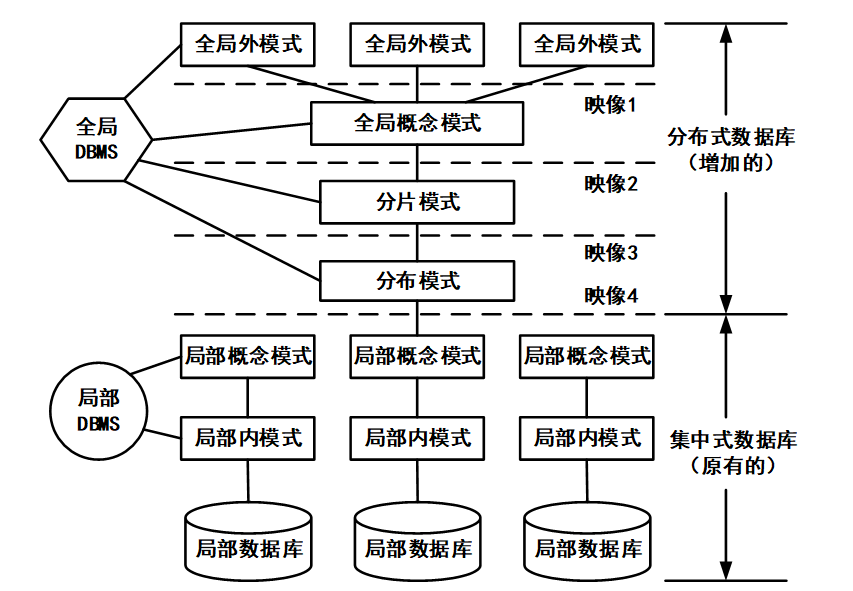

## 2015年下半年系统架构设计师考试上午真题（专业解析+参考答案）试题1

在分布式数据库中包括分片透明、复制透明、位置透明和逻辑透明等基本概念，其中：（  ）是指局部数据模型透明，即用户或应用程序无需知道局部场地使用的是哪种数据模型。

  

A. 分片透明  

B. 复制透明  

C. 位置透明  

D. 逻辑透明  

  

答案 D  

试题分析  

分片透明性是指用户不必关心数据是如何分片的，它们对数据的操作在全局关系上进行，即关心如何分片对用户是透明的，因此，当分片改变时应用程序可以不变。分片透明性是最高层次的透明性，如果用户能在全局关系一级操作，则数据如何分布，如何存储等细节自不必关心，其应用程序的编写与集中式数据库相同。  
位置透明性是指用户不必知道所操作的数据放在何处，即数据分配到哪个或哪些站点存储对用户是透明的。因此，数据分片模式的改变，如把数据从一个站点转移到另一个站点将不会影响应用程序，因而应用程序不必改写。  
局部映像透明性（逻辑透明）是指最低层次的透明性，该透明性提供数据到局部数据库的映像，即用户不必关心局部DBMS支持哪种数据模型、使用哪种数据操纵语言，数据模型和操纵语言的转换是由系统完成的。因此，局部映像透明性对异构型和同构异质的分布式数据库系统是非常重要的。  

## 2017年下半年系统架构设计师考试上午真题（专业解析+参考答案）试题2

分布式数据库两阶段提交协议中的两个阶段是指（  ）。

  

  

A. 加锁阶段、解锁阶段  

B. 获取阶段、运行阶段  

C. 表决阶段、执行阶段  

D. 扩展阶段、收缩阶段  

  

答案 C  

试题分析  

**二阶段提交**（Two-phaseCommit）是指，在计算机网络以及数据库领域内，为了使基于分布式系统架构下的所有节点在进行事务提交时保持一致性而设计的一种算（Algorithm）。

通常，**二阶段提交**也被称为是一种协议（Protocol））。

在分布式系统中，每个节点虽然可以知晓自己的操作是成功或者失败，却无法知道其他节点的操作的成功或失败。当一个事务跨越多个节点时，为了保持事务的ACID特性，需要引入一个作为协调者的组件来统一掌控所有节点（称作参与者）的操作结果并最终指示这些节点是否要把操作结果进行真正的提交（比如将更新后的数据写入磁盘等等）。因此，二阶段提交的算法思路可以概括为：参与者将操作成败通知协调者，再由协调者根据所有参与者的反馈情报决定各参与者是否要提交操作还是中止操作。  
所谓的两个阶段是指：**第一阶段：准备阶段（表决阶段）和第二阶段：提交阶段（执行阶段）。**  
**准备阶段**：事务协调者（事务管理器）给每个参与者（资源管理器）发送Prepare消息，每个参与者要么直接返回失败（如权限验证失败），要么在本地执行事务，写本地的redo和undo日志，但不提交，到达一种“万事俱备，只欠东风”的状态。  
**提交阶段**：如果协调者收到了参与者的失败消息或者超时，直接给每个参与者发送回滚（Rollback）消息；否则，发送提交（Commit）消息；参与者根据协调者的指令执行提交或者回滚操作，释放所有事务处理过程中使用的锁资源。（注意：必须在最后阶段释放锁资源）  

## 2019年下半年系统架构设计师考试上午真题（专业解析+参考答案）试题3

分布式数据库系统除了包含集中式数据库系统的模式结构之外，还增加了几个模式级别，其中（ ）定义分布式数据库中数据的整体逻辑结构，使得数据使用方便，如同没有分布一样。  

  

A. 分片模式  

B. 全局外模式  

C. 分布模式  

D. 全局概念模式  

  

答案 D  

试题分析  

本题考查的是分布式数据库相关概念。

分布式数据库体系结构如下图所示：

**全局外模式**：是对分布式数据库的最高层的抽象。

**全局概念模式**：是分布式数据库的整体抽象，包含了系统中全部数据的特性和逻辑结构，描述分布数据库全局数据的逻辑结构，是分布式数据库的全局概念视图。本题描述的是全局概念模式。

**分片模式**：描述全局数据逻辑划分的视图，是全局数据的逻辑结构根据条件的划分；每一个逻辑划分就是一个片段或称为分片。

**分配模式（分布模式）**：描述局部逻辑的局部物理结构，是划分后的片段（或分片）的物理分配视图；是全局概念层的内容。

**局部概念层**：由局部概念模式描述，是全局概念模式的子集；全局概念模式经逻辑划分后被分配在各局部场地上。

## 2020年下半年系统架构设计师考试上午真题（专业解析+参考答案）试题4

在分布式数据库中有分片透明、复制透明、位置透明和逻辑透明等基本概念。其中，（）是指用户无需知道数据存放的物理位置。  

  

A. 分片透明  

B. 逻辑透明  

C. 位置透明  

D. 复制透明  

  

答案 C  

试题分析  

本题考查的是分布式数据库的相关概念。  
**分片透明性：**是指用户不必关心数据是如何分片的，它们对数据的操作在全局关系上进行，即如何分片对用户是透明的，因此，当分片改变时应用程序可以不变。分片透明性是最高层次的透明性，如果用户能在全局关系一级操作，则数据如何分布，如何存储等细节自不必关心，其应用程序的编写与集中式数据库相同。  
**复制透明：**用户不用关心数据库在网络中各个节点的复制情况，被复制的数据的更新都由系统自动完成。在分布式数据库系统中，可以把一个场地的数据复制到其他场地存放，应用程序可以使用复制到本地的数据在本地完成分布式操作，避免通过网络传输数据，提高了系统的运行和查询效率。但是对于复制数据的更新操作，就要涉及对所有复制数据的更新。  
**位置透明性：**是指用户不必知道所操作的数据放在何处，即数据分配到哪个或哪些站点存储对用户是透明的。因此，数据分片模式的改变，如把数据从一个站点转移到另一个站点将不会影响应用程序，因而应用程序不必改写。  
**局部映像透明性（逻辑透明）：**是最低层次的透明性，该透明性提供数据到局部数据库的映像，即用户不必关心局部DBMS支持哪种数据模型、使用哪种数据操纵语言，数据模型和操纵语言的转换是由系统完成的。因此，局部映像透明性对异构型和同构异质的分布式数据库系统是非常重要的。  
综上，答案应该选C。  