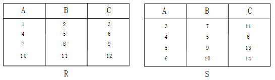

## 2014年下半年系统架构设计师考试上午真题（专业解析+参考答案）试题1

以下关于嵌入式数据库管理系统的描述不正确的是（  ）。

  

  

A. 嵌入式数据库管理系统一般只为前端应用提供基本的数据支持  

B. 嵌入式数据库管理系统一般支持实时数据的管理  

C. 嵌入式数据库管理系统一般不支持多线程并发操作  

D. 嵌入式数据库管理系统一般只提供本机服务接口  

  

答案 C  

试题分析  

嵌入式数据库管理系统（Embedded DataBase Management System, EDBMS）就是在嵌入式设备上使用的**DBMS**。由于用到**EDBMS**的嵌入式系统多是移动信息设备，例如，掌上电脑、PDA、车载设备等移动通信设备，位置固定的嵌入式设备很少用到，因此，嵌入式数据库也称为移动数据库或嵌入式移动数据库。

**EDBMS**的作用主要是解决移动计算环境下数据的管理问题，移动数据库是移动计算环境中的分布式数据库。嵌入式数据库管理系统一般只提供本机服务接口且只为前端应用提供基本的数据支持。

## 2017年下半年系统架构设计师考试上午真题（专业解析+参考答案）试题2

给定元组演算表达式R*={t│(Эu)(R(t)∧S(u)∧t\[3\]<u\[2\])} ，若关系R、S如下图所示，则（  ）。  

  

A. R*={(3，7，11)，(5，9，13)，(6，10，14)}  

B. R*={(3，7，11)，(4，5，6)，(5，9，13)，(6，10，14)}  

C. R*={(1，2，3)，(4，5，6)，(7，8，9)}  

D. R*={(1，2，3)，(4，5，6)，(7，8，9)，(10，11，12)}  

  

答案 C  

试题分析  

本题考查的是数据库中的元组演算。  

式子的意思是：

R(t)∧S(u)∧t\[3\]<u\[2\] ，t是R中的元组，且u是S中元组，且t中第三个列的数值小于u中第2个列的数值。简单的说就是：在R表中的每一条记录中，只要存在一条R.C字段比S表的数据中的S.B字段小。则输出R表的这条记录。举个例子：第2行的R.C是小于第三行和第四行的S.B的，所以第二行的（ 4，5，6 ）也是满足的，并不一定是每行对应比较，而是只要存在一条记录满足就可以。

## 2020年下半年系统架构设计师考试上午真题（专业解析+参考答案）试题3

以下关于区块链应用系统中“挖矿”行为的描述中，错误的是（）。  

  

A. 矿工“挖矿”取得区块链的记账权，同时获得代币奖励  

B. “挖矿”本质上是在尝试计算一个Hash碰撞  

C. “挖矿”是一种工作量证明机制  

D. 可以防止比特币的双花攻击  

  

答案 D  

试题分析  

本题考查了区块链技术的相关应用。

比特币网络通过“挖矿”来生成新的比特币。所谓“挖矿”实质上是用计算机解决一项复杂的数学问题，来保证比特币网络分布式记账系统的一致性。比特币网络会自动调整数学问题的难度，让整个网络约每10分钟得到一个合格答案。随后比特币网络会新生成一定量的比特币作为区块奖励，奖励获得答案的人。A选项正确。  
本质上，挖矿的过程就是计算哈希函数，并以此来确认交易的过程。哈希函数值具有不可篡改、不可逆性。但哈希函数输入的原始数据长度是不定长的，可以随意长度，而得出的摘要值是固定长度的。因此，存在一个可能，同样一个哈希值对应的不止一个数据串。这个现象就是哈希碰撞。B选项正确。  
工作量证明机制（PoW）是我们最熟知的一种共识机制。工作量证明机制PoW就是工作越多，收益越大。这里的工作就是计算出一个满足规则的随机数，谁能最快地计算出唯一的数字，谁就能做信息公示人。C选项正确。  
“双花”问题是指一笔数字现金在交易中被反复使用的现象。传统的加密数字货币和其他数字资产，都具有无限可复制性，人们在交易过程中，难以确认这笔数字现金是否已经产生过一次交易。在区块链技术中，中本聪通过对产生的每一个区块盖上时间戳（时间戳相当于区块链公证人）的方式保证了交易记录的真实性，保证每笔货币被支付后，不能再用于其他支付。在这个过程中，当且仅当包含在区块中的所有交易都是有效的且之前从未存在过的，其他节点才认同该区块的有效性。所以双花攻击解决的方法就是通过时间戳。用户发起的每一笔交易都有时间记录，“挖矿”行为不能防止双花攻击，D选项错误。  

