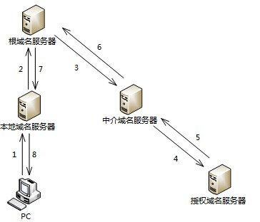

## 2012年下半年系统架构设计师考试上午真题（专业解析+参考答案）试题1

以下关于网络控制的叙述，正确的是（  ）。

  

A. 由于TCP的窗口大小是固定的，所以防止拥塞的方法只能是超时重发  

B. 在前向纠错系统中，当接收端检测到错误后就要请求发送端重发出错分组  

C. 在滑动窗口协议中，窗口的大小以及确认应答使得可以连续发送多个数据  

D. 在数据报系统中，所有连续发送的数据都可以沿着预先建立的虚通路传送  

  

答案 C  

试题分析  

**TCP采用可变大小的滑动窗口协议进行流量控制**。

在前向纠错系统中，当接收端检测到错误后就根据纠错编码的规律自行纠错；

在后向纠错系统中，接收端会请求发送端重发出错分组。

IP协议不预先建立虚电路，而是对每个数据报独立地选择路由并一站一站地进行转发，直到送达目标地。

## 2012年下半年系统架构设计师考试上午真题（专业解析+参考答案）试题2

以下关于域名服务器的叙述，错误的是（  ）。

  

A. 本地缓存域名服务不需要域名数据库  

B. 顶级域名服务器是最高层次的域名服务器  

C. 本地域名服务器可以采用递归查询和迭代查询两种查询方式  

D. 权限服务器负责将其管辖区内的主机域名转换为该主机的IP地址  

  

答案 B  

试题分析  

本题考查域名服务器及相关技术。  
可提供域名服务的包括**本地缓存、本地域名服务器、权限域名服务器、顶级域名服务器以及根域名服务器**。

DNS主机名解析的查找顺序是，先查找客户端本地缓存，如果没有成功，则向DNS服务器发出解析请求。  
本地缓存是内存中的一块区域，保存着最近被解析的主机名及其IP地址映像。由于解析程序缓存常驻内存中，所以比其他解析方法速度快。  
当一个主机发出DNS查询报文时，这个查询报文就首先被送往该主机的本地域名服务器。本地域名服务器离用户较近，当所要查询的主机也属于同一个本地ISP时，该本地域名服务器立即就能将所查询的主机名转换为它的IP地址，而不需要再去询问其他的域名服务器。  
每一个区都设置有域名服务器，即权限服务器，它负责将其管辖区内的主机域名转换为该主机的IP地址。在其上保存有所管辖区内的所有主机域名到IP地址的映射。  
顶级域名服务器负责管理在本顶级域名服务器上注册的所有二级域名。

当收到DNS查询请求时，能够将其管辖的二级域名转换为该二级域名的IP地址。或者是下一步应该找寻的域名服务器的IP地址。  
**根域名服务器**是最高层次的域名服务器。每一个根域名服务器都要存有所有**顶级域名服务器**的IP地址和域名。

当一个本地域名服务器对一个域名无法解析时，就会直接找到根域名服务器，然后根域名服务器会告知它应该去找哪一个顶级域名服务器进行查询。

## 2013年下半年系统架构设计师考试上午真题（专业解析+参考答案）试题3

主机PC对某个域名进行查询，最终由该域名的授权域名服务器解析并返回结果，查询过程如下图所示。这种查询方式中不合理的是（  ）。  

  

A. 根域名服务器采用递归查询，影响了性能  

B. 根域名服务器采用迭代查询，影响了性能  

C. 中介域名服务器采用迭代查询，加重了根域名服务器负担  

D. 中介域名服务器采用递归查询，加重了根域名服务器负担  

  

答案 A  

试题分析  

在域名解析过程中，一般有两种查询方式：递归查询和迭代查询。  
**递归查询**：服务器必须回答目标IP与域名的映射关系。  

**迭代查询**：服务器收到一次迭代查询回复一次结果，这个结果不一定是目标IP与域名的映射关系，也可以是其他DNS服务器的地址。

递归查询会向下探索，最终返回答案，迭代查询不会向下探索，会立即返回消息，可以只返回线索。

在本题中，本地域名服务器向根域名服务器发出查询请求后，根域名服务器会一层一层的进行查询，将最终结果告诉本地域名服务器，这种方式属于递归查询，这种方式增加了根域名服务器的负担，影响了性能。  

## 2016年下半年系统架构设计师考试上午真题（专业解析+参考答案）试题4

IETF定义的区分服务（DiffServ）模型要求每个IP分组都要根据IPv4协议头中的（  ）字段加上一个DS码点，然后内部路由器根据DS码点的值对分组进行调度和转发。  

A. 数据报生存期  

B. 服务类型  

C. 段偏置值  

D. 源地址  

  

答案 B  

试题分析  

**区分服务**是为解决服务质量问题在网络上将用户发送的数据流按照它对服务质量的要求划分等级的一种协议。  
区分服务将具有相同特性的若干业务流汇聚起来，为整个汇聚流提供服务，而不是面向单个业务流来提供服务。

每个IP分组都要根据其QoS需求打上一个标记，这种标记称为DS码点，可以利用IPv4协议头中的服务类型字段，或者IPv6协议头中的通信类别字段来实现，这样就维持了现有的IP分组格式不变。

## 2018年下半年系统架构设计师考试上午真题（专业解析+参考答案）试题5

在客户机上运行nslookup查询某服务器名称时能解析出IP地址，查询IP地址时却不能解析出服务器名称，解决这一问题的方法是（  ）。  

A. 清除DNS缓存  

B. 刷新DNS缓存  

C. 为该服务器创建PTR记录  

D. 重启DNS服务  

  

答案 C  

试题分析  

PTR记录是反向记录，通过IP查询域名。  

## 2018年下半年系统架构设计师考试上午真题（专业解析+参考答案）试题6

如果发送给DHCP客户端的地址已经被其他DHCP客户端使用，客户端会向服务器发送（  ）信息包拒绝接受已经分配的地址信息。

  

A. DhcpAck  

B. DhcpOffer  

C. DhcpDecline  

D. DhcpNack  

  

答案 C  

试题分析  

* Discover

DHCP客户端寻找DHCP服务器位置时所使用的报文。DHCP请求客户端时，因不知服务器位置，便在本地网络中以广播形式发送Discover请求报文。所有收到该报文的DHCP服务器会发送应答报文，以此知道服务器在网络中的位置。

* Offer

DHCP服务器收到Discover报文后，就会在所配置的地址池中查找一个合适的IP地址，加上相应的租约期限和其他配置信息（如网关 DNS服务器等），构造一个Offer报文，发送给DHCP客户端，告知用户本服务器可以为其提供IP地址。但这个报文只是告诉DHCP客户端可以提供IP地址，但最终还需要客户端通过ARP来检测该IP地址是否重复。

* Request

DHCP客户端可能会收到很多Offer请求报文，所以必须在这些应答中选择一个。通常是第一个Offer应答报文对应的服务器作为自己的目标服务器，并向该服务器发送一个广播的Request请求报文通告选择的服务器。希望获得所分配的IP地址。另外，DHCP客户端在成功获取IP地址后，在地址使用租期到达50%时，会向DHCP服务器发送单播Request请求报文延续租约，如果没有收到ACK报文，在租期达到87.5%时，会再次发送广播的Request请求报文以请求延续租约。

* ACK

DHCP服务器收到Request请求报文后，根据Request报文中携带的用户MAC来查找有没有相应的租约记录，如果有则发送ACK应答报文，通知用户可以使用分配的IP地址。

* NAK

如果DHCP服务器收到Request请求报文后，没有发现有相应的租约记录，或者由于某些原因无法正常分配地址，则向DHCP客户端发送NAK应答报文，通知用户无法分配合适的IP地址。

* Release

当DHCP客户端不再需要使用分配IP地址时（一般出现在客户端关机，下线等状况）就会主动向DHCP服务器发送RELEASE请求报文，告知服务器用户不再需要分配IP地址，请求DHCP服务器释放对应的IP地址。

* Decline

DHCP客户端收到DHCP服务器ACK应答报文后，通过地址冲突检测发现服务器分配的地址冲突或者由于其他原因导致不能使用，则会向DHCP服务器发送Decline请求报文，通知服务器所分配的IP地址不可用，以获得新的IP地址。

* Inform

DHCP客户端如果需要从DHCP服务器端获取更为详细的配置信息，则向DHCP服务器发送Inform请求报文；DHCP服务器在收到该报文后，将根据租约进行查找到相应的配置信息后，向DHCP客户端发送ACK应答报文。

## 2019年下半年系统架构设计师考试上午真题（专业解析+参考答案）试题7

TCP端口号的作用是（ ）。  

A. 流量控制  

B. ACL过滤  

C. 建立连接  

D. 对应用层进程的寻址  

  

答案 D  

试题分析  

本题考查的是TCP协议。  
TCP协议是可靠的传输层协议，会建立连接，并且可以进行流量控制，但这些不是TCP端口号的作用。因此A、C选项描述错误。  
ACL过滤：访问控制列表（Access Control List，ACL） 是路由器和交换机接口的指令列表，用来控制端口进出的数据包。ACL适用于所有的被路由协议，如IP、IPX、AppleTalk等。与TCP端口无直接关联。因此B选项错误。  
TCP协议可以依据端口号将报文交付给上层的某一进程，可以对应用层进程进行寻址。  

## 2019年下半年系统架构设计师考试上午真题（专业解析+参考答案）试题8

Web页面访问过程中，在浏览器发出HTTP请求报文之前不可能执行的操作是（ ）。

  

A. 查询本机DNS缓存，获取主机名对应的IP地址  

B. 发起DNS请求，获取主机名对应的IP地址  

C. 发送请求信息，获取将要访问的Web应用  

D. 发送ARP协议广播数据包，请求网关的MAC地址  

  

答案 C  

试题分析  

题目中说的是在浏览器发出HTTP请求报文【之前】不可能执行的操作是什么。而C选项是已经发送请求信息了，所以可以很快的选择C选项。  

 举例：  

1、我向浏览器中输入网址后，浏览器会效验网址的合法性，如果网址不合法，会传给默认的搜索引擎。  

如果网址合法并通过验证，浏览器会解析，得到协议（http或https），域名，资源页面（比如首面等）  

2、DNS查询  

浏览器会先检查域名信息是否在缓存中。  

再检查域名是否在本地的Hosts文件中。  

如果还不在，那么浏览器会向DNS服务器发送一个查询请求，获得目标服务器的IP地址。  

3、TCP封包及传输  

4、建立TCP连接后发起HTTP请求  

5、服务器接收请求并响应

## 2019年下半年系统架构设计师考试上午真题（专业解析+参考答案）试题9

以下关于DHCP服务的说法中，正确的是（ ）。 

  

A. 在一个园区网中可以存在多台DHCP服务器  

B. 默认情况下，客户端要使用DHCP服务需指定DHCP服务器地址  

C. 默认情况下，DHCP客户端选择本网段内的IP地址作为本地地址  

D. 在DHCP服务器上，DHCP服务功能默认开启  

  

答案 A  

试题分析  

因为客户端要自动获取IP，此时并不知道DHCP服务器在哪，所以B选项有误。  

DHCP服务可以服务于一个网段，也可以通过DHCP中继服务多个子网，所以C选项有误。

在DHCP服务器上，DHCP服务功能需要主动开启，不是默认开启的，所以D选项错误。

在一个网段中可以配置多台DHCP服务器，答案选A。

## 2020年下半年系统架构设计师考试上午真题（专业解析+参考答案）试题10

在Linux系统中，DNS的配置文件是（），它包含了主机的域名搜索顺序和DNS服务器的地址。  

  

A. /etc/hostname  

B. /dev/host.conf  

C. /etc/resolv.conf  

D. /dev/name .conf  

  

答案 C  

试题分析  

本题考查的是DNS的相关应用。

当进行DNS解析的时候，需要系统指定一台DNS服务器，以便当系统要解析域名的时候，可以向所设定的域名服务器进行查询。在包括Linux系统在内的大部分UNIX系统中，DNS服务器的IP地址都存放在/etc/resolv.conf文件中。也就是说在图形方式配置网络参数的时候，所设置的DNS服务器就是存放在这个文件中的。用户也完全可以用手工的方式修改这个文件的内容来进行DNS设置。配置文件不会放在dev目录下。

详解：  
/etc/resolv.conf文件的每一行是由一个关键字和随后的参数组成的，常见的关键字有：  
Nameserver：指定DNS服务器的IP地址，可以有多行，查询的时候按照次序进行，只有当一个DNS服务器不能使用的时候，才查询后面的DNS服务器。  
Domain：用来定义默认域名（主机的本地域名）。  
Search：它的多个参数指明域名查询顺序。当要查询没有域名的主机，主机将在由Search声明的域中分别查找。Domain和Search不能共存；如果同时存在，后面出现的将会被使用。  