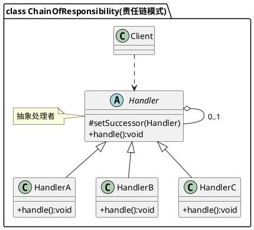

## 责任链模式

```plantuml
@startuml
skinparam classAttributeIconSize 0

package "class ChainOfResponsibility(责任链模式)"  {
    abstract class Handler
    {
    #setSuccessor(Handler)
    +handle():void
    }
    note left: 抽象处理者

    class HandlerA
    {
    +handle():void
    }

    class HandlerB
    {
    +handle():void
    }

     class HandlerC
     {
     +handle():void
     }

    Handler o-- Handler:0..1
    Handler <|-- HandlerA
    Handler <|-- HandlerB
    Handler <|-- HandlerC
    Client ..> Handler
}
@enduml
```